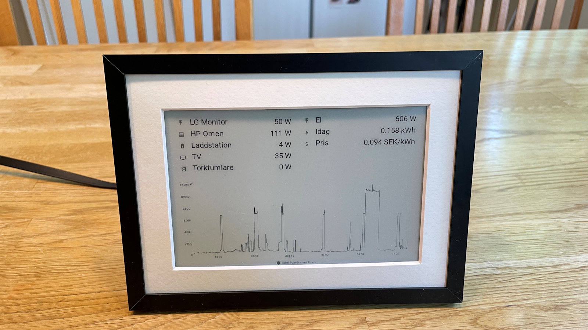

# Waveshare75-HA-dashboard

A C++ project for ESP32/ESP8266 microcontrollers to display Home Assistant dashboard data on Waveshare 7.5" e-paper displays.

<p align="center">
  
</p>


## Overview

This project provides firmware for ESP32/ESP8266 boards to create a low-power, always-on dashboard that displays Home Assistant data on Waveshare e-paper displays. The e-paper technology ensures excellent readability and minimal power consumption.

The code is based on the [demo code provided by Waveshare](https://github.com/waveshareteam/e-Paper), and modified to work with the specific use case of downloading screen shot images from Home Assistant and displaying them on the e-paper display.

## Hardware Requirements

- **Microcontroller**: ESP32 or ESP8266 development board
  - I used the [Waveshare Universal e-Paper Raw Panel Driver Board](https://www.waveshare.com/e-paper-esp32-driver-board.htm)
- **Display**: Waveshare 7.5" e-paper display with black + 2 gray levels
  - Amazon: [Waveshare 7.5 Inch E-Paper Raw Display Panel V2 800x480 Resolution](https://www.amazon.se/Waveshare-Resolution-Electronic-Controller-Communicating/dp/B075R69T93/)
- **Power**: USB power supply or battery pack
- **Connectivity**: WiFi connection for Home Assistant access
- Optional: A **picture frame** and passe-partout to make the display look more like a real device.
  - I used the [IKEA Lomviken](https://www.ikea.com/se/sv/p/lomviken-ram-svart-70518202/) 13x18 cm frame which looks pretty good. Unfortunately the passe-partout hides the edges of the display, so I needed to make sure that there are empty margins around display contents. 


## Software Requirements

- **PlatformIO**: For building and uploading the firmware
- **Home Assistant**: Since the ESP32 is far too weak to render HTML content, a scheduled job [Home Assistant Lovelace Kindle Screensaver](https://github.com/sibbl/hass-lovelace-kindle-screensaver) is set up on the Home Assistant server to take a screenshot of the dashboards and save them to BMP files. These can then be downloaded to the ESP32 via the local network and displayed on the e-paper display.

## Project Structure

```
src/
├── main.cpp              # Main application code
├── EPD.h                 # E-paper display interface
├── GUI_Paint.cpp         # Graphics and drawing utilities
├── DEV_Config.cpp        # Device configuration
├── fonts/                # Font definitions for display
└── utility/              # Display driver implementations
```

## Getting Started

1. **Install PlatformIO**: Follow the [PlatformIO installation guide](https://platformio.org/install)

2. **Clone the Repository**:
   ```bash
   git clone https://github.com/yourusername/Waveshare75-HA-dashboard.git
   cd Waveshare75-HA-dashboard
   ```

3. **Configure the Project**:
   - Edit `platformio.ini` to match your board configuration
   - Modify `src/main.cpp` to include your ~~WiFi credentials~~ (**TODO: Describe how to use Wifi Manager**) and set up Home Assistant screenshot tool

4. **Build and Upload**:
   ```bash
   pio run --target upload
   ```

## Configuration

The main configuration is done in `src/main.cpp`:
- WiFi SSID and password
- Home Assistant server URLs
- Update intervals
- Display layout preferences


## Building

This project uses PlatformIO for building and deployment:

```bash
# Build the project
pio run

# Upload to device
pio run --target upload

# Monitor serial output
pio device monitor
```

## Troubleshooting

- **Display not working**: Check wiring connections and ensure correct display model is selected
- **WiFi connection issues**: Verify credentials and network availability
- **Build errors**: Ensure PlatformIO is properly installed and dependencies are resolved

## Contributing

1. Fork the repository
2. Create a feature branch
3. Make your changes
4. Submit a pull request

## License

This project is licensed under the MIT License - see the [LICENSE](LICENSE) file for details.

## Acknowledgments

- Waveshare for the e-paper display hardware and [drivers](https://github.com/waveshareteam/e-Paper)
- PlatformIO for the development framework
- Home Assistant community for inspiration

